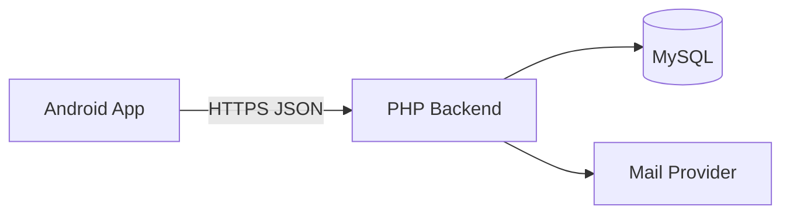
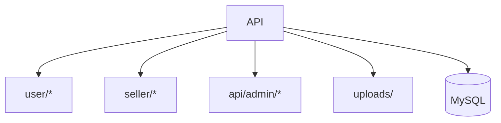
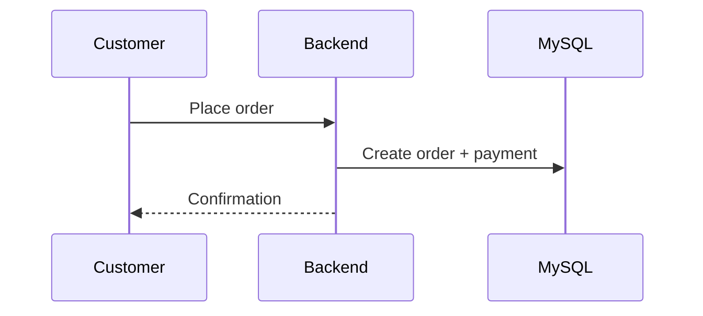
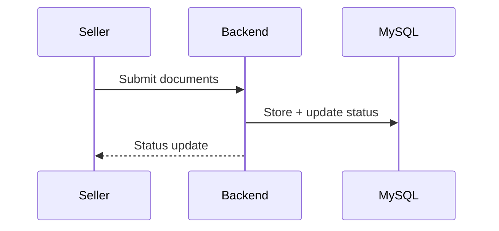

# HarborFresh Backend

Dock-to-door seafood marketplace backend for customer ordering, seller onboarding, and admin review workflows.

    

Built by Shashank Preetham Pendyala

---

## Overview

HarborFresh backend powers a multi-role seafood marketplace. It exposes REST-style PHP endpoints for customer checkout, seller onboarding and verification, and admin review tools, backed by MySQL and SMTP email delivery.

Success is measured by:
- API latency and error rate under peak load
- Seller verification throughput and accuracy
- Order creation and payment success rate
- Operational reliability and observability

---

## Table of Contents

- [Demo](#demo)
- [Features](#features)
- [Architecture](#architecture)
- [Layered Architecture](#layered-architecture)
- [Module Inventory](#module-inventory)
- [Tech Stack](#tech-stack)
- [Project Structure](#project-structure)
- [Backend API Map](#backend-api-map)
- [Workflow](#workflow)
- [Workflow Diagrams](#workflow-diagrams)
- [Data Model Summary](#data-model-summary)
- [Environment Variables](#environment-variables)
- [Setup and Run](#setup-and-run)
- [Run, Build, Test](#run-build-test)
- [Configuration](#configuration)
- [Deployment](#deployment)
- [Monitoring and Logging](#monitoring-and-logging)
- [Security Notes](#security-notes)
- [Troubleshooting](#troubleshooting)
- [Roadmap](#roadmap)
- [License](#license)

---

## Demo


---

## Features

### Customer

- OTP signup/login
- Profile, address, and delivery slot management
- Catalog browsing and search
- Cart, order placement, and payment capture
- Order tracking

### Seller

- Registration and login
- Multi-step onboarding and KYC verification
- Dashboard and order management
- Product creation

### Admin

- Seller review and verification status updates
- Pending verification list and seller detail view

---

## Architecture

### System Overview



### Service View



---

## Layered Architecture

### API Layer

- PHP endpoints grouped by role
- JSON input/output
- Basic validation and response standardization

### Data Layer

- MySQL tables for users, sellers, orders, products
- Onboarding state and verification artifacts

### Integration Layer

- PHPMailer for OTP and notifications
- File uploads for seller documents

---

## Module Inventory

- `user/` customer endpoints
- `seller/` seller endpoints
- `api/admin/` admin endpoints
- `api/seller/` seller onboarding endpoints
- `database/` migrations and SQL
- `uploads/` document store

---

## Tech Stack

- PHP 7.x / 8.x
- MySQL 5.7+ / 8.x
- PHPMailer
- XAMPP local dev

---

## Project Structure

- `db.php` database connection
- `mail_config.php` SMTP configuration
- `harborfresh.sql` schema
- `user/` customer endpoints
- `seller/` seller endpoints
- `api/` onboarding and admin endpoints

---

## Backend API Map

| Area | Base Path | Description |
| --- | --- | --- |
| Customer | `user/*` | Auth, catalog, orders, tracking |
| Seller | `seller/*` | Orders, products, fulfillment |
| Seller Onboarding | `api/seller/*` | KYC and verification |
| Admin | `api/admin/*` | Seller approvals and status updates |

---

## Workflow

### Customer Order

1. Customer authenticates via OTP
2. Browses catalog and places order
3. Payment captured and order created
4. Order tracking updates returned to app

### Seller Verification

1. Seller registers
2. Completes onboarding steps
3. Admin reviews and updates status
4. Seller dashboard unlocked on approval

---

## Workflow Diagrams

### Order Placement



### Seller Verification



---

## Data Model Summary

Core entities:
- Users, pending_users, sellers
- Products, categories
- Orders, order items, payments
- Addresses, delivery slots
- Verification steps and KYC artifacts

---

## Environment Variables

Set via system environment:
- `HARBORFRESH_FROM_EMAIL`
- `HARBORFRESH_SMTP_ENABLED`
- `HARBORFRESH_SMTP_HOST`
- `HARBORFRESH_SMTP_PORT`
- `HARBORFRESH_SMTP_USER`
- `HARBORFRESH_SMTP_PASS`
- `HARBORFRESH_SMTP_SECURE`

---

## Setup and Run

### Prerequisites

- XAMPP (Apache + MySQL)
- PHP 7.x or 8.x

### Quick Start

1. Start Apache and MySQL in XAMPP
2. Import schema: `harborfresh.sql`
3. Set SMTP env vars if needed
4. Serve from `C:\xampp\htdocs\harborfresh_backend`

---

## Run, Build, Test

```bash
# No build step required
# Use curl or Postman to test endpoints
```

---

## Configuration

- Database in `db.php`
- SMTP in `mail_config.php` (env-driven)
- SQL schema in `harborfresh.sql`

---

## Deployment

- For production, use Nginx/Apache + PHP-FPM
- Configure HTTPS and secure SMTP credentials

---

## Monitoring and Logging

- Use server logs for PHP errors
- Add request logging for audit trails

---

## Security Notes

- Never commit real SMTP secrets
- Validate and sanitize all file uploads
- Use HTTPS in production

---

## Troubleshooting

- If API fails, check `db.php` connection
- If OTP email fails, verify SMTP env vars
- If uploads fail, check filesystem permissions

---

## Roadmap

- Webhooks for delivery updates
- Rate limiting and abuse protection
- Audit logs for admin actions

---

## License

MIT License.
See [LICENSE](LICENSE).
